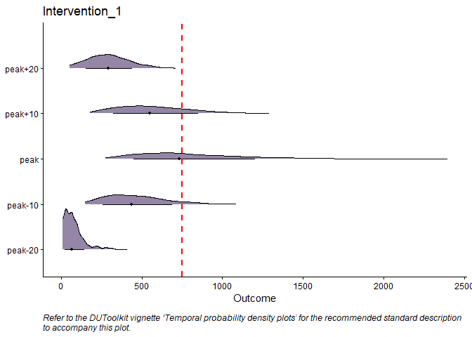

<!-- README.md is generated from README.Rmd. Please edit that file -->

<h1>
DUToolkit
</h1>
<!-- badges: start -->
<!-- badges: end -->

The DUToolkit package provides a suite of tools and visualization for
the characterization, estimation, and communication of parameter
uncertainty and decision risk. The package is designed to evaluate the
impact of policy alternatives on outcomes compared to baseline (i.e.,
counterfactual analysis), leveraging model outputs from uncertainty
analysis.

During public health crises such as the COVID-19 pandemic,
decision-makers relied on models to predict and estimate the impact of
various policy alternatives on health outcomes. Often, there is a high
degree of uncertainty in the evidence base underpinning these models.
When there is increased uncertainty, the risk of selecting a policy
option that does not align with the intended policy objective also
increases; we term this decision risk. Even when models adequately
capture uncertainty, the tools used to communicate their outcomes,
underlying uncertainty, and the associated decision risk are important
to mitigate decisions to adopt sub-optimal policies and/or critical
health technologies.

## Installation

You can install the ‘DUToolkit’ package from CRAN with the following
command in the console:

    #> Installing package into 'C:/Users/mwiggins/AppData/Local/Temp/RtmpQvV8Ba/temp_libpath404c71cf3415'
    #> (as 'lib' is unspecified)
    #> Warning: package 'DUToolkit' is not available for this version of R
    #> 
    #> A version of this package for your version of R might be available elsewhere,
    #> see the ideas at
    #> https://cran.r-project.org/doc/manuals/r-patched/R-admin.html#Installing-packages

## Usage

    #>                    Baseline Intervention 1
    #> Risk               "23078"  "2007"        
    #> Policy risk impact "-"      "-91%"

    #>   N  outcome     i_time
    #> 1 1 4207.443 2021-01-26
    #> 2 2 1681.521 2021-02-01
    #> 3 3 2539.177 2021-02-04
    #> 4 4 2969.721 2021-01-31
    #> 5 5 3073.741 2021-02-05
    #> 6 6 1520.144 2021-02-08

    #>    750   1000   2000 
    #> 0.9494 0.8887 0.5895

    #>                    Baseline Intervention 1
    #> Risk               "1501"   "157"         
    #> Policy risk impact "-"      "-90%"

    #>   time  outcome
    #> 1 peak 4207.443
    #> 2 peak 1681.521
    #> 3 peak 2539.177
    #> 4 peak 2969.721
    #> 5 peak 3073.741
    #> 6 peak 1520.144

    #>   time_step   n      q1  median    mean      q3
    #> 1   peak-20 813   90.32  136.99  157.21  210.21
    #> 2   peak-10 813  738.29 1013.14 1005.52 1260.49
    #> 3      peak 813 1520.14 2300.14 2247.85 2982.81
    #> 4   peak+10 813  884.80 1246.00 1211.20 1548.80
    #> 5   peak+20 813  247.77  326.34  338.76  418.55

## Acknowledgments

We would like to thank everyone whom we engaged with including workshop
participants for their feedback on the Decision Uncertainty Toolkit.
